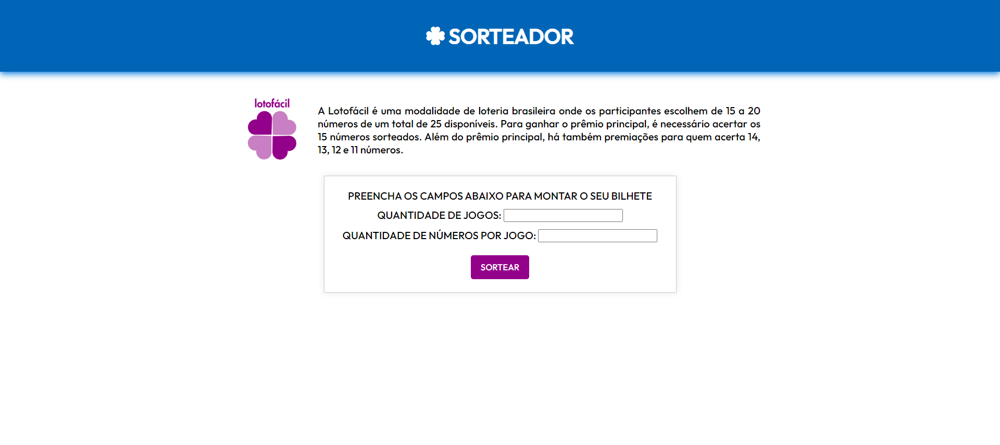
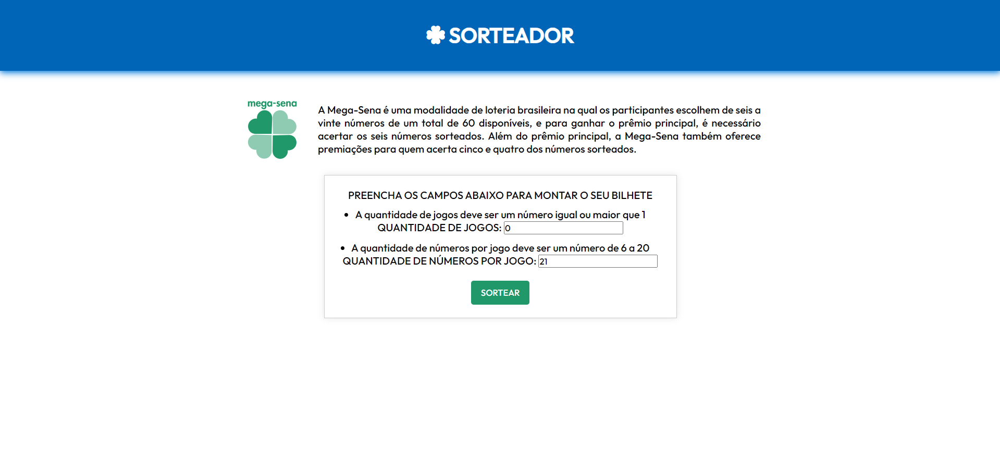
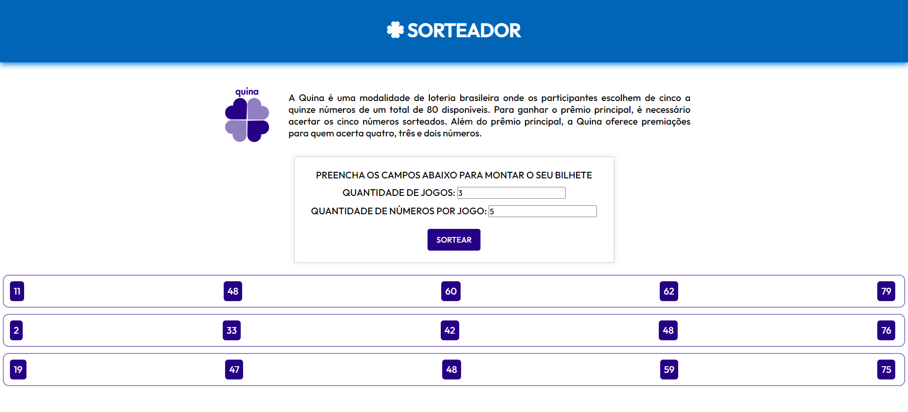

## Sorteador - Gerador de Bilhete de Loteria

O projeto tem como objetivo gerar bilhetes aleatórios para os três principais jogos da loteria brasileira (Lotofácil, Mega-Sena e Quina).

Para a construção da aplicação Web foram utilizadas as seguintes tecnologias:
- Python
- Django  
- HTML
- CSS

O Sorteador permite que o usuário selecione a quantidade de jogos e a quantidade de números em cada jogo do bilhete.

Caso o usuário entre com valores não aceitos para o determinado jogo, ele será informado quais são os números aceitos.

Após preencher os campos de maneira correta e, em seguida, clicar em 'SORTEAR', é retornado o bilhete com jogos aletórios e não repetidos com a quantida de números informada anteriormente.

#### Como executar a Aplicação Web

Instale o Python (https://www.python.org/)

Realize o clone do projeto

Em seguida, na pasta 'sorteador', execute os seguintes comandos:
    
    pip install django

    python manage.py runserver

